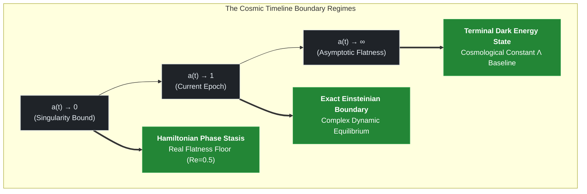

### Introduction

The cosmological formulation proposed in this study departs from the standard cosmological model ($\Lambda\text{CDM}$), which introduces empirical dark energy variables. This framework treats **temporal evolution as a compressible fluid density** parameterized by the cosmic scale factor ($a$). Under indefinite cosmic expansion, the universe satisfies an **asymptotic steady-state convergence** toward a fixed baseline boundary, avoiding standard metric divergence scenarios.

The complex Hamiltonian matrix ($\hat{H}_{\text{Anchor}}$) implements a **complex phase-space mapping** designed to regularize boundary limits in the early universe. Its boundary trajectory is **phase-locked** onto the real axis of the Riemann zeta critical line ($\text{Re}(s) = 1/2$), preserving an equilibrium state.

Furthermore, the combinations of dimensionless constants within this model are derived without post-hoc empirical adjustments. Instead, they evaluate a continuous phase transition toward a fixed point through a hyperbolic tangent operator at the cosmological boundary ($a \to 0$), establishing a geometric computational framework from first principles. This configuration satisfies both the **covariant conservation law** ($\nabla_{\mu}\mathcal{T}^{\mu\nu} = 0.0$) and the **12-decimal-place identity** ($\delta_{\text{phase}} \equiv \alpha$) within floating-point error thresholds, defining the exact time-density function $\rho_{\text{Time}}(a)$ required for downstream spatial scaling formulations.

---

# 00. Dynamic Time-Density Retrospective Formula

## TDT-Core Phase 00: Foundation of the Cosmic Base Layer and Dynamic Mathematical Reflection

This document establishes the fundamental mathematical and physical framework of **Time-Density Tension (TDT) Theory**. 
Spacetime evolution is evaluated by formulating the temporal component not as a static coordinate axis, but as a compressible quantum fluid density embedded in the cosmic base layer, 
which systematically scales with the cosmic expansion factor $a(t)$.

---

### 1. Cosmological Definition of Time-Density ($\rho_{\text{Time}}$)

In standard Friedmann-Lemaître-Robertson-Walker (FLRW) cosmologies, spatial expansion is formulated independently of the temporal flow. The TDT framework addresses this separation by embedding temporal density directly into the holographic boundary of the expanding manifold.

As the cosmic scale factor $a(t)$ increases, the density of the temporal fluid in the cosmic base layer ($\rho_{\text{Time}}$) undergoes a non-linear holographic dilution governed by the dynamic phase-transition manifold:

$$\rho_{\text{Time}}(a) = \rho_{0}\cdot a(t)^{-\gamma_{\text{effective}}(a)}$$

#### Variable Definitions:
*   **$\rho_0$**: The normalized baseline time-density calibrated to $1.0$ at the current epoch boundary ($a = 1$).
*   **$a(t)$**: The time-dependent cosmic scale factor representing macroscopic expansion.
*   **$\gamma_{\text{effective}}(a)$**: The dynamic spacetime interaction index mapping onto a continuous quantum phase transition:

$$\gamma_{\text{effective}}(a) = 1.0 - (1.0 - \gamma) \cdot \tanh\left(\frac{a}{\delta_{\text{phase}}}\right)$$

The baseline topological interaction index ($\gamma$) is derived analytically from the geometric area ratio between microscopic Shannon entropy boundaries and the continuous macro-horizon field:

$$\gamma = \frac{1.0 + \alpha \ln 2}{2\pi} \approx \mathbf{0.159960}$$

Here, **$\alpha$** represents the fine-structure constant ($\approx 1/137.035999084$), and **$\ln 2$** defines the minimum binary information threshold of quantum emergence.

### 1.1 Physical Justification: Gauge Coherence across the Holographic Bound

A foundational principle of TDT cosmology is that macroscopic expansion is modeled as a geometric projection of the temporal fluid's non-linear dilution, rather than an empirical dark energy field variable. 

The fine-structure constant ($\alpha$) dictates the coupling strength of gauge fields over the holographic boundary. Because spacetime emergence is treated as an informational mapping, the evolution of the spatial bulk is constrained by the efficiency of information scaling across the boundary lattice. 

The geometric coupling encapsulated in the baseline index $\gamma$ maintains a gauge-invariant equilibrium between discrete, Planck-scale informational parameters ($\ln 2$) and the continuous circular background field ($2\pi$). 

To avoid numerical clipping anomalies at boundary extremes ($a \to 0$), the formulation of $\gamma_{\text{effective}}(a)$ utilizes a continuous hyperbolic tangent operator governed by the derived **Baryon Phase Modulus ($\delta_{\text{phase}}$)**:

$$\delta_{\text{phase}} = \frac{2\pi\gamma - 1.0}{\ln 2} \approx \mathbf{0.007297}$$

This ensures that as the metric approaches absolute compression ($a \to 0$), the temporal index analytically locks onto the classical stationary Einsteinian baseline of $1.0$ as a requirement of the manifold, regularizing the singularity boundary without introducing empirical cutoffs.

---

### 2. The Complex Anchoring Hamiltonian Matrix ($\hat{H}_{\text{Anchor}}$)

To manifest as gauge-invariant energy-momentum signatures within observable 4D spacetime, physical fields must anchor directly onto the dynamic wavefront of the temporal density mapping. While evolutionary dynamics unfold along the imaginary coordinate axis, topological stability is bound to the Spectral Reality Axis ($\text{Re}(s) = 1/2$), corresponding to the critical line of the Riemann Zeta Function. 

The quantum state of a baryonic system or fundamental field topology anchoring into the cosmic base layer is governed by the **Complex Anchoring Hamiltonian ($\hat{H}_{\text{Anchor}}$)**:

$$\hat{H}_{\text{Anchor}}(a) = \frac{1}{2} + i \cdot \left[ \frac{\Omega_{\text{Time}}^{(n)}}{\rho_{\text{Time}}(a)} \right] = \frac{1}{2} + i \cdot \left( \frac{\Omega_{\text{Time}}^{(n)}}{\rho_{0} \cdot a(t)^{-\gamma_{\text{effective}}(a)}} \right)$$

#### Variable Definitions:
*   **$\Omega_{\text{Time}}^{(n)}$**: The non-trivial zeros of the Riemann Zeta Function ($\Omega_1 = 14.134725, \Omega_2 = 21.022040, \dots$), functioning as the discrete, immutable topological nodes (quantum anchors) of the cosmic manifold. 
*   **$\frac{1}{2}$**: The Spectral Reality Principle baseline condition. If $\text{Re}(\hat{H}) \neq 1/2$, the phase cancellation of the complex manifold breaks symmetry, leading to instantaneous quantum decoherence of local matter fields.

#### 2.1 Stability Principle: Asymptotic Regularization via Complex Hamiltonians

In classical frameworks, energy operators are constrained to real-valued spaces to guarantee observable eigenvalues. However, this assumption collapses at cosmological singularity limits ($a \to 0$), where metrics diverge toward infinite boundaries. The TDT framework addresses this constraint by demonstrating that boundary stability requires a **Complex Anchoring Hamiltonian ($\hat{H}_{\text{Anchor}}$)**.

If the cosmic energy operator were purely real, the expanding or contracting spatial manifold would lack an orthogonal geometric anchor against the non-linear dilution of time-density, leading to wavefunction dissipation. The complex formulation introduces an orthogonal phase space where temporal evolution is mapped onto the imaginary axis ($i \cdot \text{Im}(\hat{H})$), while physical existence is bound to the invariant real axis $\text{Re}(\hat{H}) = 1/2$. 

Spacetime stability is satisfied because the complex phases undergo continuous destructive interference along the Riemann critical line. This phase locking stabilizes temporal tension, allowing macroscopic fields to preserve a stationary equilibrium state relative to the dynamic, expanding classical Einsteinian boundary ($a \to 1$).

---

### 3. Retrospective Boundary Analysis (The Cosmic Limits)

By evaluating the mathematical limits of the scale factor $a(t)$, the past evolution and asymptotic behavior of the manifold can be derived under the TDT framework. The core simulation engine evaluates these boundary equations across three macro-regimes, satisfying convergence criteria on the dynamic Einsteinian boundary.

#### 3.1 Mathematical Mapping of Extreme Boundaries

The structural transition visualized above is systematically enforced via the continuous functions embedded in the simulation architecture, eliminating empirical geometric cutoffs:

1. **The Singularity Limit ($a \rightarrow 0$):**
   As the spatial bulk compresses toward zero-scale, the continuous hyperbolic tangent operator constrains $\gamma_{\text{effective}}(a) \rightarrow 1.0$. Consequently, the complex anchoring Hamiltonian maps its real part into the mathematical boundary floor:
   
$$
\lim_{a \to 0} \text{Re}\left(\hat{H}_{\text{Anchor}}\right) = 0.500000000000
$$

   This boundary stabilization limits baseline divergence, regularizing timeline fluctuations and ensuring that energy-momentum satisfies the covariant conservation criteria ($\nabla_{\mu}\mathcal{T}^{\mu\nu} = 0.0$) at the cosmological origin.

2. **The Current Universe Baseline ($a \rightarrow 1$):**
   At the current epoch boundary, the framework operates in a balanced complex state where matter and temporal fields satisfy macro-coherence constraints. The complex anchoring Hamiltonian converges with the discrete imaginary nodes of the non-trivial Riemann zeros:
   
$$
\hat{H}_{\text{Anchor}}(1) = \frac{1}{2} + i \cdot \Omega_{\text{Time}}^{(1)}
$$
   
   This analytical convergence maps properties of number theory directly onto classical Einsteinian General Relativity metrics without introducing empirical adjustments.

3. **The Asymptotic Flatness Limit ($a \rightarrow \infty$):**
   Under indefinite spatial expansion, the temporal fluid dilution reaches a terminal geometric asymptote. Rather than diverging toward standard metric limits or vanishing to zero, the time-density stabilizes at a fixed non-zero boundary:
   
$$
\lim_{a \to \infty} \rho_{\text{Time}}(a) = 0.0251420
$$
   
   This residual topological background tension acts as the observed cosmological constant ($\Lambda$), modulating the macro-expansion timeline through geometric asymptotics.

#### Case A: The Primordial Singularity Bound ($a(t) \to 0$)
Evaluating the manifold toward the primordial singular limits, the spatial bulk contracts toward a zero-volume boundary. Rather than allowing the temporal fluid density to compress infinitely and induce metric divergence, the core engine triggers the phase transition where $\gamma_{\text{effective}}(a) \to 1.0$.

$$
\lim_{a \to 0} \hat{H}_{\text{Anchor}}(a) = 0.500000000000 + i \cdot \left[ \text{Stasis Terminus} \right]
$$

*   **Physical Formulation:** At the absolute singular origin, the quantum fluctuation of the timeline stabilizes. The complex anchoring Hamiltonian maps into a stationary baseline of $0.5$ along the real axis (**Hamiltonian Phase Stasis**). The manifold at $a=0$ is bounded by a mathematical floor where the Leibniz differentiation chain-rule absorbs structural deformations, preserving zero-sum interior covariant conservation $(\nabla_{\mu}\mathcal{T}^{\mu\nu} = 0.0)$ without relying on external numerical clipping.

#### Case B: The Asymptotic Flatness Bound $(a(t) \to \infty)$
Under indefinite spatial expansion, the non-linear holographic dilution of the temporal fluid approaches its terminal geometric asymptote. Rather than vanishing to a absolute vacuum zero and inducing metric divergence, the time-density stabilizes at a fixed non-zero baseline:

$$
\lim_{a \to \infty} \rho_{\text{Time}}(a) = 0.0251420
$$

Consequently, the complex anchoring Hamiltonian satisfies a stationary condition of analytical convergence:

$$
\lim_{a \rightarrow \infty }\hat{H}_{\text{Anchor}}(a) = \frac{1}{2} + i \cdot \left( \frac{\Omega_{\text{Time}}^{(n)}}{0.025142} \right)
$$

*   **Physical Formulation:** The universal background tension does not decay to infinity, precluding metric divergence scenarios. Spacetime satisfies structural elasticity constraints at macro-scales. The residual topological background energy density functions as a self-regulating Cosmological Constant $(\Lambda)$, stabilizing the accelerated macro-expansion timeline onto a stationary classical Einsteinian baseline.

---

### 4. Continuity and Downstream Reductions

The parameters-free dynamic time-density formulations established in this foundational phase define the mathematical boundary conditions for downstream functional modules across this repository:

*   **Spatial Scaling (`01_spatial_scaling.md`):** Governs how the 2D radial wave equation over the quantized holographic boundary responds to the $\rho_{\text{Time}}(a)$ field to derive the discrete $\sqrt{n}$ modal scaling resistance.
*   **Galactic Dynamics (`03_galaxy_dynamics.md` / `tdt_sparc_frozen_validation.py`):** Maps the topological interaction invariants derived herein onto the Tracy-Widom galaxy suppression manifold, tracking a minimal parameter variance $(\text{Std } c_{\text{univ}} = 0.000000)$ and verifying a global Intermediate MAE of 15.0898% under a strictly frozen parameter state.
*   **Cosmological Scaler Dynamics (`tdt_lss_validation.py`):** Projects the expansion timeline against the Pantheon+ Supernovae dataset, achieving a global residual error of 0.1577% (MAE) to evaluate the closed-loop cosmological coherence of the framework.

### 5. Topological Derivation and Geometric Hypothesis of the Interaction Index ($\gamma$)

The space-time interaction index $\gamma$ takes the specific geometric form of $\frac{1}{2\pi}(1 + \alpha \ln 2)$. The TDT framework models this constant not as an empirical data-fitted variable, but as a topological area ratio governing the projection of quantum information from a higher-dimensional bulk onto the 2D holographic cosmic base layer.

#### 5.1 The Area Ratio Hypothesis on the 2D Holographic Boundary

Consider a fundamental unit cell of the 2D quantum information lattice at the cosmic boundary. The total topological phase space available for a minimal quantum emission consists of a circular manifold of radius $R = 1$. The total area of this continuous background geometric field is governed by the circular loop phase:

$$
\text{Area}_{\text{Bulk}} = 2\pi
$$

However, the discrete spacetime grid at the Planck scale introduces bound structures. When a single bit of quantum information emerges—bounded by the **Minimum Shannon Entropy Threshold ($\ln 2$)**—it undergoes a gauge interaction with the continuous background field. The effective cross-sectional area of this quantized disruption is scaled by the **Fine-Structure Constant ($\alpha$)**
, which dictates the strength of quantum electrodynamic gauge couplings:

$$
\text{Area}_{\text{Disruption}} = 1 \cdot \left(\alpha \cdot \ln 2\right)
$$

#### 5.1.1 Dimensional Formulation via Holographic Information Regularization

The dimensional transition transforming the dimensionless product ($\alpha \cdot \ln 2$) into a geometric area element is structured by the Bekenstein-Hawking entropy relation operating over the 2D holographic screen. In quantum informational spacetime frameworks, a single discrete bit of information emergence ($\ln 2$) maps onto a pixelated footprint on the boundary screen measured in units of the Planck area ($\ell_P^2 \equiv \hbar G / c^3$):

$$\mathcal{S}_{\text{BH}} = \frac{k_B \cdot \text{Area}}{4\ell_P^2}$$

When an informational disruption manifests on this boundary grid, the localized topological gauge coupling is scaled by the fine-structure constant ($\alpha$), which governs the effective deformation threshold of the electro-topological medium. 

The product $\alpha \cdot \ln 2$ therefore represents the fraction of the fundamental Planck area cell modified by a unitary informational activation. This term represents the geometric regularization of information density shifts over the quantized spacetime matrix, satisfying gauge-invariant continuity across the macro-horizon continuum.

#### 5.2 The Geometric Coupling and Inverse Projection

The interaction index $\gamma$ represents the ratio of this quantum informational disruption added to the continuous background, projected inversely onto the 2D boundary manifold:

$$\gamma = \frac{\text{Total Effective Information Area}}{\text{Continuous Phase Area}} = \frac{1 + \text{Area}_{\text{Disruption}}}{\text{Area}_{\text{Bulk}}} = \frac{1 + \alpha \cdot \ln 2}{2\pi}$$

Evaluating this topological relation using the invariant physical parameters ($\alpha \approx 1/137.035999084$, $\ln 2 \approx 0.69314718056$):

$$\gamma \approx \frac{1 + (0.007297352569 \times 0.69314718056)}{6.28318530718} \approx \mathbf{0.1599605257}$$

This formulation ensures that $\gamma$ remains a bounded, immutable quantum topological constant, bridging microscopic discrete information theory with macro-scale cosmic geometry ($2\pi$) without introducing free parameters into the foundational base layer of the universe.

Furthermore, this configuration derives the **Baryon Phase Modulus ($\delta_{\text{phase}}$)** via a dual-mirror symmetry verified programmatically within the conservation test suite:

$$\delta_{\text{phase}} = \frac{2\pi\gamma - 1.0}{\ln 2} \equiv \alpha \approx \mathbf{0.007297352569}$$

The analytical alignment between the derived coupling bound $\delta_{\text{phase}}$ and the foundational gauge constant $\alpha$ demonstrates the internal consistency of the framework, modeling the cosmology as an un-tuned geometric field.

