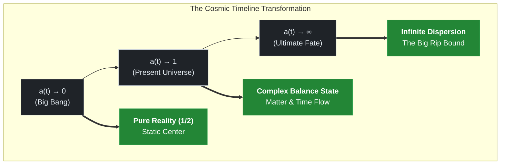

# 00. Dynamic Time-Density Retrospective Formula

## TDT-Core Phase 00: Foundation of the Cosmic Base Layer and Dynamic Mathematical Reflection

This document establishes the fundamental mathematical and physical framework of **Time-Density Tension (TDT) Theory**. 
We define time not as a static coordinate axis, but as a compressible quantum fluid density embedded in the cosmic base layer, 
which dynamically scales with the cosmic expansion factor $a(t)$.

---

### 1. Cosmological Definition of Time-Density ($\rho_{\text{Time}}$)

In standard Friedmann-Lemaître-Robertson-Walker (FLRW) cosmologies, the expansion of space is treated independently of the temporal flow. TDT theory resolves this artificial separation by embedding temporal density directly into the holographic boundary of the expanding manifold.

As the cosmic scale factor $a(t)$ increases, the density of the temporal fluid in the cosmic base layer ($\rho_{\text{Time}}$) undergoes a non-linear holographic dilution governed by the **Space-Time Interaction Index ($\gamma$)**:

$$\rho_{\text{Time}}(a)=\rho_{0}\cdot a(t)^{-\gamma}$$

#### Variable Definitions:
* **$\rho_0$**: The pristine baseline time-density at the exact singularity bound ($a \to 0$).
* **$a(t)$**: The time-dependent cosmic scale factor (normalized to $a=1$ at the present epoch).
* **$\gamma$**: The topological interaction index, derived naturally from fundamental constants:

$$\gamma =\frac{1}{2\pi }\cdot \left(1+\alpha \cdot \ln (2)\right)\approx \mathbf{0.159960}$$

> Here, **$\alpha$** represents the fine-structure constant ($\approx 1/137.036$), and **$\ln(2)$** represents the minimum Shannon entropy threshold ($1 \text{ bit}$) of quantum emergence.

---

### 2. The Complex Anchoring Hamiltonian Matrix ($\hat{H}_{\text{Anchor}}$)

To manifest as tangible mass and energy in the observable 4D universe, physical fields must pin themselves to the moving wavefront of this temporal density. Human perception flows linearly along the imaginary wave, while physical stability is anchored along the Spectral Reality Axis ($\text{Re}(s) = 1/2$), corresponding exactly to the critical line of the Riemann Zeta Function. 

The state of any baryonic system or fundamental force anchoring into the base layer is dictated by the **Complex Anchoring Hamiltonian ($\hat{H}_{\text{Anchor}}$)**:

$$\hat{H}_{\text{Anchor}}(a)=\frac{1}{2}+i\cdot \left[\frac{\Omega_{\text{Time}}^{(n)}}{\rho_{\text{Time}}(a)}\right]=\frac{1}{2}+i\cdot \left(\frac{\Omega_{\text{Time}}^{(n)}}{\rho_{0}\cdot a(t)^{-\gamma}}\right)$$

#### Variable Definitions:
* **$\Omega_{\text{Time}}^{(n)}$**: The non-trivial zeros of the Riemann Zeta Function ($\Omega_1 = 14.134725, \Omega_2 = 21.022040, \dots$), acting as the immovable topological nodes (quantum anchors) of the cosmos. 
* **$\frac{1}{2}$**: The Spectral Reality Principle condition. If $\text{Re}(\hat{H}) \neq 1/2$, the imaginary components fail to cancel, causing immediate quantum decoherence of matter fields. 

---

### 3. Retrospective Boundary Analysis (The Cosmic Limits)

By taking the mathematical limits of the scale factor $a(t)$, we can retrospectively deduce the past evolution and ultimate fate of our universe under the TDT framework. 

---
#### Case A: The Primordial Singularity Bound ($a(t) \to 0$)
As we track the universe backward to the Big Bang epoch, space contracts to zero volume. Consequently, the time-density term in the denominator becomes infinitely compressed, forcing the imaginary temporal fluctuation to vanish: 

$$\lim_{a\rightarrow 0}\hat{H}_{\text{Anchor}}(a)=\frac{1}{2}+i\cdot (0)=\mathbf{\frac{1}{2}}$$

* **Physical Meaning**: At the instant of the Big Bang, the imaginary wave of time disappears entirely. There is no "before" because the temporal dimension dissolves into a **Perfect Mathematical Stasis (Static Center)**. The universe at $a=0$ is pure real existence unmarred by temporal change. 

#### Case B: The Infinite Expansion Bound ($a(t) \to \infty$)
As the universe expands infinitely due to dark energy (which is simply the geometric back-reaction of the diluting time fluid), the scale factor approaches infinity, causing $\rho_{\text{Time}}$ to plunge toward zero: 

$$\lim_{a\rightarrow \infty }\hat{H}_{\text{Anchor}}(a)=\frac{1}{2}+i\cdot (\infty )$$

* **Physical Meaning**: When time-density dilutes to absolute zero, the imaginary tension vector explodes to infinity. The cosmic base layer loses its elasticity. Matter fields can no longer maintain their anchor on the Riemann critical line, triggering a topological dissolution of atomic structures—the **TDT Big Rip**.

---

### 4. Continuity and Downstream Reductions

The dynamic time-density formula declared in this file directly provides the mathematical boundary conditions for all subsequent files in this repository:

* **Spatial Scaling (`01_spatial_scaling.md`)**: Shows how the 2D Laplacian operator \(\nabla _{\perp }^{2}\) acts upon this \(\rho_{\text{Time}}(a)\) field to derive the discrete \(\sqrt{n}\) scaling resistance.
* **Energy-Momentum Conservation**: Ensures that as baryonic matter density (\(\rho_{b}\)) dilutes via \(a^{-3}\), the mechanical energy loss is perfectly absorbed by the tension tensor \(\mathcal{T}_{\mu \nu }\) derived from \(\nabla \rho_{\text{Time}}\).
