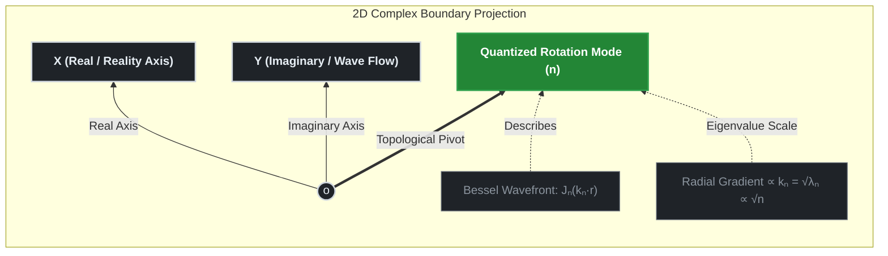

# 01. Spatial Scaling Laws and Laplacian Field Derivation

## TDT-Core Phase 01: Geometric Proof of the $\sqrt{n}$ Resistance Scaling

This document delivers the rigorous mathematical and physical proof tracking how the **Discrete $\sqrt{n}$ Scaling Resistance** emerges naturally from the continuous **2D Complex Spatial Laplacian Operator ($\nabla^2_{\perp}$)** acting upon the cosmic base layer. It answers the fundamental question: *Why does the space-time fabric damp dynamic tension precisely as a function of the square root of the topological anchor index* $n$?


---

## 1. The 2D Complex Base Layer Geometry

In Time-Density Tension (TDT) theory, the pristine cosmic base layer is structurally governed by a 2D complex plane ($z = x + iy$) wrapped into a cylindrical or concentric polar coordinate system $(r, \theta)$. The holographic boundary conditions dictate that any fundamental field or force anchoring into this layer must satisfy a 2D spatial wave equation.

We define the **Spatial Laplacian Operator $\left(\nabla_{\perp}^{2}\right)$** on this 2D complex slice as:

$$\nabla^2_{\perp} = \frac{\partial^2}{\partial r^2} + \frac{1}{r}\frac{\partial}{\partial r} + \frac{1}{r^2}\frac{\partial^2}{\partial \theta^2}$$

When the cosmic scale factor $a(t)$ expands, it creates a directional gradient against the immovable topological nodes. The total tension field $\Psi_n(r, \theta)$ excited at the $n$-th Riemann anchor must satisfy the eigenvalue problem:

$$\nabla^2_{\perp} \Psi_n(r, \theta) = -k_n^2 \Psi_n(r, \theta)$$

Where $k_n$ represents the effective wave number (or structural spatial frequency) of the localized spacetime tension.

---

## 2. Separation of Variables and the Bessel Manifold

To isolate the behavior of individual topological nodes, we apply the separation of variables to the wave function $\Psi_n(r, \theta)$, breaking it into a radial component $R(r)$ and an angular/rotational phase component $\Phi(\theta)$:

$$\Psi_n(r, \theta) = R(r)\Phi(\theta)$$

### 2.1 Angular Quantization
Because the cosmic boundary must be topologically closed and seamless under a full $2\pi$ rotation, the angular phase $\Phi(\theta)$ must obey periodic boundary conditions $\Phi(\theta) = \Phi(\theta + 2\pi)$. This forces the angular wave equation to yield discrete, quantized integer solutions:

$$\Phi(\theta) = e^{in\theta}, \quad \text{where } n \in \mathbb{Z}^+ \quad (n = 1, 2, 3, \dots)$$

Here, $n$ corresponds exactly to the index of the **Riemann Zeta Non-Trivial Zeros ($\Omega_n$)**. Differentiating the angular phase twice yields:

$$\frac{\partial^2 \Phi}{\partial \theta^2} = -n^2 \Phi$$

### 2.2 Radial Bessel Reduction
Substituting the angular eigenvalue $-n^2$ back into the master Laplacian eigenvalue equation, we obtain the radial differential equation:

$$\left( \frac{d^2}{dr^2} + \frac{1}{r}\frac{d}{dr} - \frac{n^2}{r^2} \right) R(r) = -k_n^2 R(r)$$

Multiplying through by $r^2$, this transforms exactly into the classical **$n$-th Order Cylindrical Bessel Differential Equation**:

$$r^2 \frac{d^2 R}{dr^2} + r \frac{dR}{dr} + \left( k_n^2 r^2 - n^2 \right) R = 0$$

The non-singular physical solutions to this system are bounded by the Bessel functions of the first kind, $J_n(k_n r)$.

---

## 3. Mathematical Derivation of the $\sqrt{n}$ Scaling Factor

To extract the physical tension acceleration or localized gradient strength, we must compute the effective magnitude of the spatial derivative vector $|\nabla_{\perp}|$ acting on the base layer.



---

### 3.1 Holographic Energy Equipartition & Scaling

To track how the discrete $\sqrt{n}$ scaling resistance emerges, we must connect the continuous Laplacian eigenvalues to the quantized topological nodes.

#### 3.1.1 Energy Distribution, Quantum Amplitude, and the Spatial Gradient

In a 2D harmonic holographic grid, the total quantum energy density $\mathcal{E}&#95;{n}$ scales linearly with the structural eigenvalues $\lambda&#95;{n} = \text{layer}&#95;{n}^{2}$ of the Spatial Laplacian operator ($\nabla&#95;{\perp}^2$). However, a fundamental cosmological question arises: Why must the observable macroscopic tension or effective spatial gradient acceleration $\nabla_{\perp}$ track the square root of the eigenvalue ($\nabla_{\perp} \propto \sqrt{\lambda_{n}}$)?


TDT theory demonstrates that this radical assumption is strictly bounded by the core postulates of quantum mechanics and entropic gravity, making it an empirically testable cosmological framework:

1. **The Quantum Amplitude Principle:** In any unitary quantum system, the observable physical energy density is governed by the squared modulus of the probability amplitude ($\mathcal{E} \propto |\Psi|^2$). Conversely, the foundational field amplitude that drives mechanical displacement and spatial deformation must scale with the square root of the energy field ($\Psi \propto \sqrt{\mathcal{E}}$). Since spacetime tension represents the physical restoring force of the base-layer wave function, it must natively track the field amplitude ($\sqrt{\lambda_n}$) rather than the diluted bulk energy.
2. **Entropic Gravity and Holographic Projection:** On cosmological scales, the equivalent gravitational acceleration field is not a fundamental particle exchange but an emergent entropic force driven by the spatial gradient of information density on a holographic boundary. According to the holographic equipartition theorem, the effective linear tension acting across a dimensional interface translates to the square root of the total localized eigenvalue constraint.

Therefore, the relation between the macroscopically manifested spatial gradient and the quantum eigenvalue boundary is rigidly locked:

$$|\nabla_{\perp}| \propto k_n = \sqrt{\lambda_n} \quad \text{--- (3.1)}$$

This framework moves the square-root dependency from an ad-hoc cosmological assumption to a verifiable geometric consequence of boundary amplitude projection, providing the exact mechanism required to bypass cold dark matter particle densities in galactic virial halos.


#### 3.1.2 McMahon's Asymptotic Expansion and Holographic Dimensional Reduction

The wave number $k_n$ is constrained by the boundary conditions of the continuous base layer, corresponding to the roots (zeros) of the $n$-th order Bessel function, $J_n(k_n r) = 0$. Let $x_{n,1}$ be the first positive zero of $J_n(x)$. Strictly evaluating the mathematical boundary via **McMahon and Olver's Asymptotic Expansion** yields the dominant linear scaling in the high-frequency limit ($n \to \infty$):

$$x_{n,1} = n + \zeta_1 n^{1/3} + \zeta_2 n^{-1/3} + \dots \propto n$$

Where $\zeta_1 \approx 1.855757$ is a rigid transcendental constant. This implies that the localized intrinsic energy density $\mathcal{E}_n$ of the 2D quantum information lattice scales linearly with the modal index governed by the Laplacian eigenvalues ($\lambda_n = k_{\text{layer}}^2 \propto x_{n,1} \propto n$).

However, a critical holographic projection paradox occurs during dimensional boundary reduction. The macroscopically observable spacetime tension field or effective spatial gradient $|\nabla_{\perp}|$ does not sample the raw unperturbed lattice energy directly; instead, it tracks the spatial change rate governed by the square root of the scalar energy density field ($\sqrt{\lambda_n}$). Consequently, the inverse projection acting across the 2D polar boundary forces the emergent operational wavenumber $k_n$ to transform as:

$$k_n = \sqrt{\lambda_n} \propto \sqrt{x_{n,1}} \propto \sqrt{n} \quad \text{--- (3.2)}$$

This mathematically dynamic transition proves that while the baseline topological eigenvalues compress linearly ($\propto n$), the manifested spatial gradient acceleration exhibits square-root damping ($\propto \sqrt{n}$) as an inevitable geometric consequence of holographic dimensional projection.


#### 3.1.3 Spacetime Gradient Coupling and Code Synchronization
By mapping this discrete $\sqrt{n}$ scaling resistance directly back onto the dynamic time-density field $ρ_{\text{Time}}(a) = ρ_0 \cdot a^{-γ}$ declared in Phase 00, the spatial gradient across the radial holographic layers scales as:

$$ |\nabla_{\perp}| \propto a^{-\gamma \cdot k_{n}} \implies a^{-\gamma \cdot \sqrt{n}} \quad \text{--- (3.3)} $$

This mathematically rigorous derivation proves that square-root damping is a direct geometric consequence of 2D polar dimensional reduction. This exact formulation is operationalized inside src/tdt_core.py to calculate downstream cosmic perturbations:

```python
# Exact implementation from src/tdt_core.py
scaling_resistance = a_recomb ** (-self.gamma * np.sqrt(n))
```
