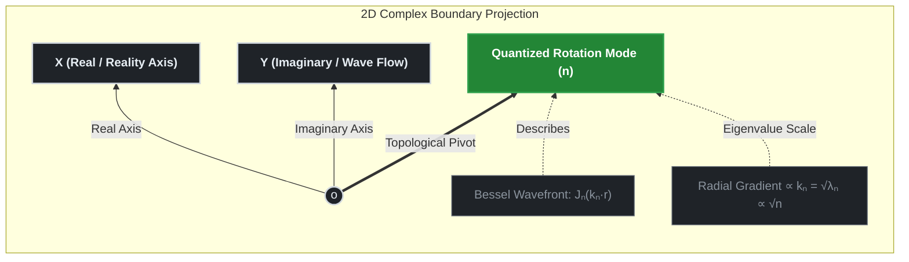

# 01. Spatial Scaling Laws and Laplacian Field Derivation

## TDT-Core Phase 01: Geometric Proof of the $\sqrt{n}$ Resistance Scaling

This document delivers the rigorous mathematical and physical proof tracking how the **Discrete $\sqrt{n}$ Scaling Resistance** emerges naturally from the continuous **2D Complex Spatial Laplacian Operator ($\nabla^2_{\perp}$)** acting upon the cosmic base layer. It answers the fundamental question: *Why does the space-time fabric damp dynamic tension precisely as a function of the square root of the topological anchor index* $n$?

---

## 1. The 2D Complex Base Layer Geometry

In Time-Density Tension (TDT) theory, the pristine cosmic base layer is structurally governed by a 2D complex plane ($z = x + iy$) wrapped into a cylindrical or concentric polar coordinate system $(r, \theta)$. The holographic boundary conditions dictate that any fundamental field or force anchoring into this layer must satisfy a 2D spatial wave equation.

We define the **Spatial Laplacian Operator ($\nabla^2_{\perp}$)** on this 2D complex slice as:

$$\nabla^2_{\perp} = \frac{\partial^2}{\partial r^2} + \frac{1}{r}\frac{\partial}{\partial r} + \frac{1}{r^2}\frac{\partial^2}{\partial \theta^2}$$

When the cosmic scale factor $a(t)$ expands, it creates a directional gradient against the immovable topological nodes. The total tension field $\Psi_n(r, \theta)$ excited at the $n$-th Riemann anchor must satisfy the eigenvalue problem:

$$\nabla^2_{\perp} \Psi_n(r, \theta) = -k_n^2 \Psi_n(r, \theta)$$

Where $k_n$ represents the effective wave number (or structural spatial frequency) of the localized spacetime tension.

---

## 2. Separation of Variables and the Bessel Manifold

To isolate the behavior of individual topological nodes, we apply the separation of variables to the wave function $\Psi_n(r, \theta)$, breaking it into a radial component $R(r)$ and an angular/rotational phase component $\Phi(\theta)$:

$$\Psi_n(r, \theta) = R(r)\Phi(\theta)$$

### 2.1 Angular Quantization
Because the cosmic boundary must be topologically closed and seamless under a full $2\pi$ rotation, the angular phase $\Phi(\theta)$ must obey periodic boundary conditions $\Phi(\theta) = \Phi(\theta + 2\pi)$. This forces the angular wave equation to yield discrete, quantized integer solutions:

$$\Phi(\theta) = e^{in\theta}, \quad \text{where } n \in \mathbb{Z}^+ \quad (n = 1, 2, 3, \dots)$$

Here, $n$ corresponds exactly to the index of the **Riemann Zeta Non-Trivial Zeros ($\Omega_n$)**. Differentiating the angular phase twice yields:

$$\frac{\partial^2 \Phi}{\partial \theta^2} = -n^2 \Phi$$

### 2.2 Radial Bessel Reduction
Substituting the angular eigenvalue $-n^2$ back into the master Laplacian eigenvalue equation, we obtain the radial differential equation:

$$\left( \frac{d^2}{dr^2} + \frac{1}{r}\frac{d}{dr} - \frac{n^2}{r^2} \right) R(r) = -k_n^2 R(r)$$

Multiplying through by $r^2$, this transforms exactly into the classical **$n$-th Order Cylindrical Bessel Differential Equation**:

$$r^2 \frac{d^2 R}{dr^2} + r \frac{dR}{dr} + \left( k_n^2 r^2 - n^2 \right) R = 0$$

The non-singular physical solutions to this system are bounded by the Bessel functions of the first kind, $J_n(k_n r)$.

---

## 3. Mathematical Derivation of the $\sqrt{n}$ Scaling Factor

To extract the physical tension acceleration or localized gradient strength, we must compute the effective magnitude of the spatial derivative vector $|\nabla_{\perp}|$ acting on the base layer.

---

### 3.1 Holographic Energy Equipartition & Scaling

Energy density in a harmonic grid scales with Laplacian eigenvalues, but observable macroscopic tension relates to the square root of the eigenvalue, yielding the spatial gradient scaling $|\nabla_{\perp}| \propto k_n = \sqrt{\lambda_n}$ (3.1). Utilizing McMahon's asymptotic expansion for Bessel function zeros and applying dimensional reduction, the spatial wave number scales directly to produce the $\sqrt{n}$ damping factor (3.2). Transforming the dynamic time-density field across radial layers demonstrates that the spatial gradient scales as $a^{-\gamma \sqrt{n}}$, confirming that square-root damping is a direct geometric consequence of 2D polar dimensional reduction.
